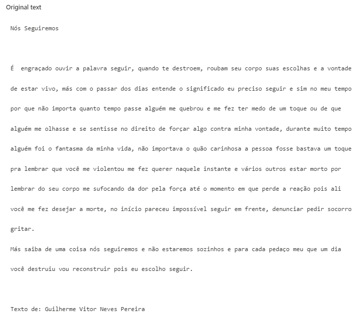
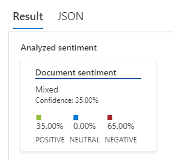
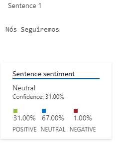
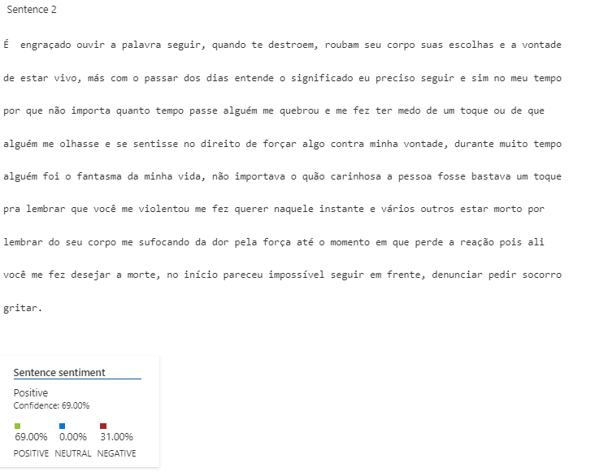
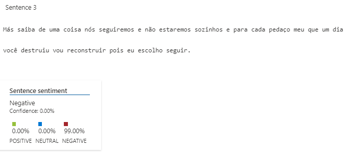
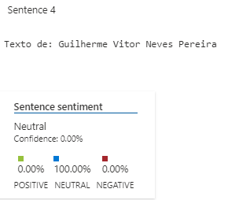

# Language Studio

[Language Studio](https://aka.ms/languageStudio) é um conjunto de ferramentas baseadas em UI que permite explorar, criar e integrar recursos do Azure AI Language em seus aplicativos.

O Language Studio fornece uma plataforma para experimentar vários recursos de serviço e ver o que eles retornam de maneira visual. Ele também fornece uma experiência fácil de usar para criar projetos e modelos personalizados para trabalhar em seus dados. Usando o Studio, você pode começar sem precisar escrever código e, em seguida, usar as bibliotecas de cliente e APIs REST disponíveis em seu aplicativo.

## Explorar o Estúdio de Fala

O serviço **Azure AI Speech** transcreve a fala em texto e o texto em fala audível. Você pode usar o AI Speech para criar um aplicativo que possa transcrever notas de reuniões ou gerar texto a partir da gravação de entrevistas.

Neste exercício, você experimentará os recursos do Azure AI Speech usando o Azure AI Speech Studio.

Criar um recurso *de fala do Azure AI*

Você pode usar o serviço de Fala criando um recurso **de Fala** ou um recurso **de serviços de IA do Azure** .

Neste exercício, você criará um recurso AI Speech, a menos que já tenha um recurso que possa usar.

1. Em outra guia do navegador, abra [o Azure AI Speech Studio](https://speech.microsoft.com/) , entrando com sua conta da Microsoft.
1. Selecione **Configurações** e depois **Crie um recurso.** Configure-o com as seguintes configurações:
   1. **Nome do novo recurso** : *Insira um nome exclusivo* .
   1. **Assinatura** : *sua assinatura do Azure* .
   1. **Região** : *Selecione uma [região suportada*](https://learn.microsoft.com/azure/ai-services/speech-service/regions)* .
   1. **Nível de preços** : *FO gratuito (se disponível, caso contrário, selecione Standard S0).*
   1. **Grupo de recursos** : *selecione ou crie um grupo de recursos com um nome exclusivo* .
1. Selecione **Criar recurso.** Aguarde até que o recurso seja criado e selecione **Usar recurso** . A página Introdução à Fala é exibida.

Explore a fala em texto no Speech Studio

1. Selecione [**https://aka.ms/mslearn-speech-files**](https://aka.ms/mslearn-speech-files) para baixar **o speak.zip** . Abra a pasta.
1. Na página Introdução à fala, em *Fala para texto,* localize *Fala em tempo real para texto* . Selecione **Experimente a fala em tempo real para texto** .

   

1. Em *Escolher arquivos de áudio* , selecione **Procurar arquivos** e navegue até a pasta onde você salvou o arquivo. Selecione **WhatAICanDo.m4a** e depois **Abrir** .

   

1. O serviço Speech transcreve e exibe o texto em tempo real. Se você tiver áudio em seu computador, poderá ouvir a gravação enquanto o texto é transcrito.
1. Revise a saída, que deve ter reconhecido e transcrito com êxito o áudio em texto.

**Observação** Se você receber uma mensagem de erro, aguarde alguns minutos antes de tentar novamente. Demora um pouco para que o recurso Fala fique disponível para o primeiro uso.

Neste exercício você criou um recurso AI Speech no Speech Studio. Em seguida, você usou o serviço de fala em texto em tempo real para transcrever uma gravação de áudio. Você pôde ver a transcrição do texto sendo gerada à medida que o arquivo de áudio era reproduzido.

Limpar

Se não pretende fazer mais exercícios, exclua todos os recursos que não precisa mais. Isso evita acumular custos desnecessários.

1. Abra o [portal do Azure](https://portal.azure.com/) e selecione o grupo de recursos que contém o recurso que você criou.
1. Selecione o recurso e selecione **Excluir** e depois **Sim** para confirmar. O recurso é então excluído.

## Analise texto com Language Studio

Neste exercício, você explorará os recursos da linguagem Azure AI analisando alguns exemplos de avaliações de hotéis. Você usará o Language Studio para entender se as avaliações são em sua maioria positivas ou negativas.

O Processamento de Linguagem Natural (PNL) é um ramo da IA ​​que lida com a linguagem escrita e falada. Você pode usar a PNL para construir soluções que extraiam significado semântico de texto ou fala, ou que formulem respostas significativas em linguagem natural.

Por exemplo, suponha que a agência de viagens fictícia Margie's Travel incentive os clientes a enviar avaliações sobre estadias em hotéis. Você pode usar o serviço de idiomas para identificar frases-chave, determinar quais avaliações são positivas e quais são negativas ou analisar o texto da avaliação em busca de menções a entidades conhecidas, como locais ou pessoas.

O Azure AI Language Service inclui análise de texto e recursos de PNL. Isso inclui a identificação de frases-chave no texto e a classificação do texto com base no sentimento.

Crie um recurso *de idioma*

Você pode usar muitos recursos do Azure AI Language com um recurso **de idioma** ou **de serviços do Azure AI** . Existem alguns casos em que apenas um recurso Idioma pode ser usado. Para o exercício abaixo, utilizaremos um recurso **Linguagem** . Se ainda não o fez, crie um recurso **de idioma** na sua assinatura do Azure.

1. Em outra guia do navegador, abra o portal do Azure em [https://portal.azure.com](https://portal.azure.com/?azure-portal=true) , entrando com a conta da Microsoft associada à sua assinatura do Azure.
1. Clique no botão **＋Criar um recurso** e pesquise *Serviço de idioma* . Selecione **criar** um plano **de serviço de idiomas** . Você será levado a uma página para **selecionar recursos adicionais** . Mantenha a seleção padrão e clique em **Continuar para criar seu recurso** .
1. Na página **Criar Idioma** , configure-o com as seguintes configurações:
   1. **Assinatura** : *sua assinatura do Azure* .
   1. **Grupo de recursos** : *selecione ou crie um grupo de recursos com um nome exclusivo* .
   1. **Região** : Leste dos EUA.
   1. **Nome** : *Insira um nome exclusivo* .
   1. **Nível de preços** : *F0 grátis ou S se F0 grátis não estiver disponível*
   1. **Ao marcar esta caixa, confirmo que li e compreendi todos os termos abaixo** : *Selecionado* .
1. Selecione **Revisar + criar** e depois **Criar** e aguarde a conclusão da implantação.

Configure seu recurso no Azure AI Language Studio

1. Em outra guia do navegador, abra **o Language Studio** em [https://language.cognitive.azure.com](https://language.cognitive.azure.com/?azure-portal=true) e entre.
1. Quando solicitado com **Select an Azure resource** , faça as seguintes configurações:
   1. **Diretório do Azure** : *diretório padrão, o diretório que você está usando*
   1. **Assinatura do Azure** : *selecione a assinatura que você está usando*
   1. **Tipo de recurso** : Idioma
   1. **Nome do recurso** : *selecione o recurso de serviço de idioma que você acabou de criar*

Em seguida, selecione **Concluído** .

**Importante** : a partir de julho de 2023, os serviços de IA do Azure abrangem tudo o que era anteriormente conhecido como Serviços Cognitivos e Serviços de IA Aplicados do Azure. Algumas interfaces de usuário ainda estão atualizando suas referências de Cognitive Servicespara Azure AI services. Os dois nomes referem-se ao mesmo tipo de recurso.

**Observação** : se você ***não*** for solicitado a escolher um recurso de idioma, pode ser porque você possui vários recursos de idioma em sua assinatura; nesse caso:

1. Na barra na parte superior da página, selecione **Configurações (⚙)** .
1. Na página **Configurações** , visualize a guia **Recursos** .
1. Selecione o recurso que você acabou de criar e selecione **Alternar recurso** . Certifique-se de que a identidade gerenciada esteja **habilitada** . !
1. No topo da página, selecione **Language Studio** para retornar à página inicial do Language Studio.

Analise avaliações no Language Studio

1. Num navegador web, navegue até **Language Studio** em [https://language.cognitive.azure.com](https://language.cognitive.azure.com/?azure-portal=true) .
1. Na página inicial **Bem-vindo ao Language Studio** , selecione a guia **Classificar texto e, em seguida, selecione o bloco Analisar sentimento e extrair opiniões** .
1. Em *Selecionar idioma do texto* , selecione **Inglês** .
1. Em *Selecione seu recurso do Azure* , selecione seu recurso.
1. Em *Digite seu próprio texto, carregue um arquivo ou use um de nossos textos de exemplo* , copie e cole a seguinte revisão:

        Código

   ` `Tired hotel with poor service

   ` `The Royal Hotel, London, United Kingdom

   ` `5/6/2018

   ` `This is an old hotel (has been around since 1950's) and the room furnishings are average - becoming a bit old now and require changing. The internet didn't work and had to come to one of their office rooms to check in for my flight home. The website says it's close to the British Museum, but it's too far to walk.

1. Marque a caixa para confirmar que a demonstração incorrerá em uso e poderá incorrer em custos e selecione **Executar** .
1. Revise a saída. Observe que o *documento* é analisado quanto ao sentimento, assim como cada *frase* . Selecione **Frase 1** para mostrar a análise de sentimento dessa frase.

Observe que há um sentimento geral seguido por pontuações próximas a três categorias: *pontuação positiva* , *pontuação neutra* e *pontuação negativa* . Em cada uma das categorias é atribuída uma pontuação entre 0 e 1. Essas pontuações de confiança indicam a probabilidade do texto fornecido ser um sentimento específico.

Selecione **a frase 1** novamente para fechar.

1. Role para cima para selecionar **Limpar caixa de texto** e copie e cole a seguinte revisão:

        Código

   ` `Good Hotel and staff

   ` `The Royal Hotel, London, UK

   ` `3/2/2018

   ` `Clean rooms, good service, great location near Buckingham Palace and Westminster Abbey, and so on. We thoroughly enjoyed our stay. The courtyard is very peaceful and we went to a restaurant which is part of the same group and is Indian ( West coast so plenty of fish) with a Michelin Star. We had the taster menu which was fabulous. The rooms were very well appointed with a kitchen, lounge, bedroom and enormous bathroom. Thoroughly recommended.

1. Selecione **Executar** . Revise o resultado e o sentimento e o nível de confiança.
1. Selecione **Limpar** caixa de texto novamente e copie e cole a seguinte revisão:

Muito barulhento e os quartos são pequenos The Lombard Hotel, São Francisco, EUA 05/09/2018 O hotel está localizado na rua Lombard, que é uma rua muito movimentada de SEIS pistas, diretamente da Ponte Golden Gate. Tráfego desde o início da manhã até tarde da noite, especialmente nos finais de semana. O ruído não seria tão ruim se os quartos fossem melhor isolados, mas não são. Tive que colocar algodão nos ouvidos para conseguir dormir – estava cansado demais para aproveitar a cidade no dia seguinte. Os quartos são MINÚSCULOS. Escolhi o quarto porque tinha duas camas queen size – mas o quarto mal tinha espaço para acomodá-las. Com uma família de quatro pessoas na sala, era apertado. Com tudo isso dito, os quartos são limpos e eles fizeram um esforço para atualizá-los. O hotel fica no bairro de Marina, com muitos bons lugares para comer, a uma curta caminhada do Presidio. Pode ser um bom hotel para jovens adultos que ficam acordados até tarde com um orçamento limitado

1. Selecione **Executar** e analise o sentimento juntamente com o nível de confiança. Dê uma olhada no texto e compare-o com a análise de sentimento que o serviço retornou.

Neste exercício você usou o Language Studio para criar um novo recurso de idioma ou usar um recurso de idioma existente. Você habilitou o recurso em Configurações antes de experimentar o serviço de mineração de sentimento e opinião. Em seguida, você testou o serviço com três trechos de texto.

Limpar

Se não pretende fazer mais exercícios, exclua todos os recursos que não precisa mais. Isso evita acumular custos desnecessários.

1. Abra o **portal do Azure** em [https://portal.azure.com](https://portal.azure.com/) e selecione o grupo de recursos que contém o recurso que você criou.
1. Selecione o recurso e selecione **Excluir** e depois **Sim** para confirmar. O recurso é então excluído.

## Execução do texto para análise

### Texto inserido:
        
        Nós Seguiremos

        É  engraçado ouvir a palavra seguir, quando te destroem, roubam seu corpo suas escolhas e a vontade de estar vivo, más com o passar dos dias entende o significado eu preciso seguir e sim no meu tempo por que não importa quanto tempo passe alguém me quebrou e me fez ter medo de um toque ou de que alguém me olhasse e se sentisse no direito de forçar algo contra minha vontade, durante muito tempo alguém foi o fantasma da minha vida, não importava o quão carinhosa a pessoa fosse bastava um toque pra lembrar que você me violentou me fez querer naquele instante e vários outros estar morto por lembrar do seu corpo me sufocando da dor pela força até o momento em que perde a reação pois ali você me fez desejar a morte, no início pareceu impossível seguir em frente, denunciar pedir socorro gritar.
        Más saiba de uma coisa nós seguiremos e não estaremos sozinhos e para cada pedaço meu que um dia você destruiu vou reconstruir pois eu escolho seguir.

        Texto de: Guilherme Vitor Neves Pereira 

### Imagem do texto

### Resultados obtidos

